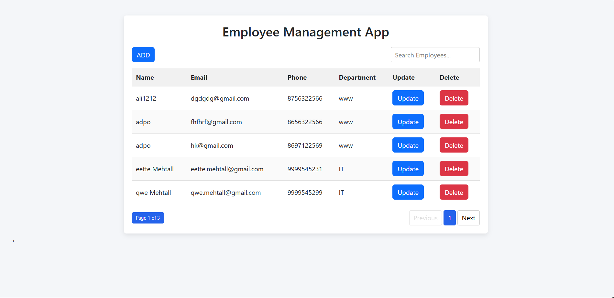
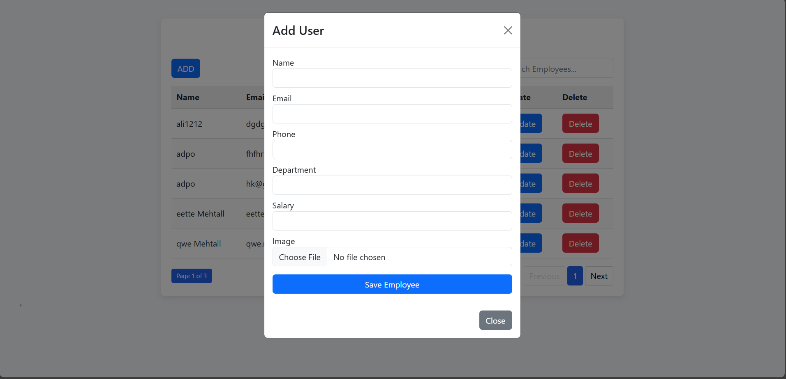
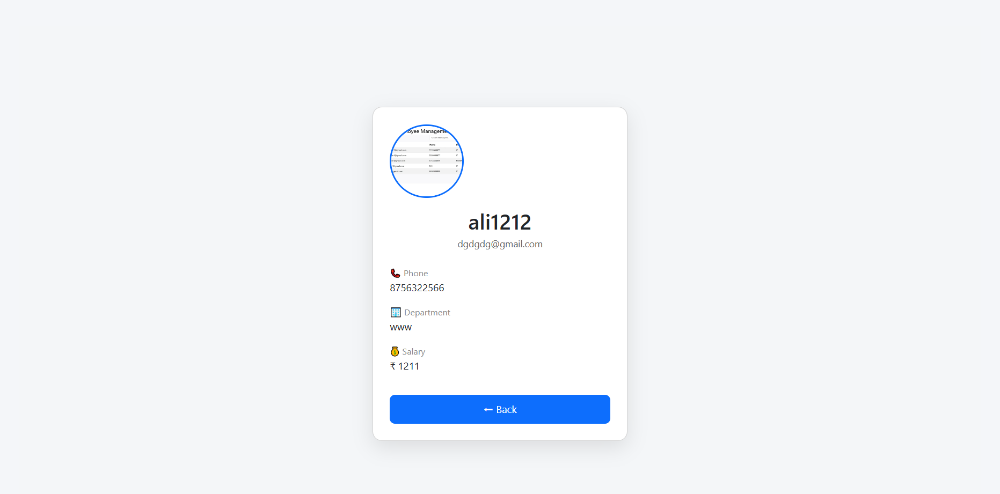

# MERN Employee Management System

A full-stack **Employee Management Application** built using the **MERN stack (MongoDB, Express.js, React, Node.js)**.  
This project demonstrates how to build a complete CRUD-based system with image upload, search, pagination, and a responsive UI.

---

## 📌 Features

- Create, Read, Update, and Delete (CRUD) employees
- RESTful APIs using Node.js and Express
- MongoDB integration for data storage
- Image upload and management using Cloudinary
- Advanced search and filtering
- Efficient pagination for large datasets
- Responsive UI built with React
- Smooth navigation using React Router
- Environment-based configuration using `.env`

---

## 🛠️ Tech Stack

### Frontend
- React
- React Router
- JavaScript (ES6+)
- HTML5 & CSS3

### Backend
- Node.js
- Express.js
- MongoDB (Mongoose)

### Other Tools & Services
- Cloudinary (Image Upload)
- Git & GitHub
- MongoDB Atlas

---

## 🖼️ Application Screenshots

### Employee List Page

---

### Add / Edit Employee

---

### Employee Details

